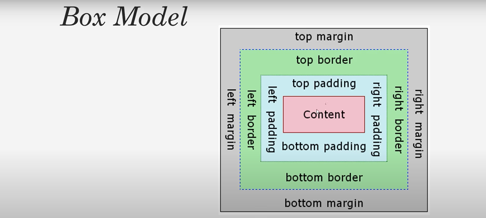
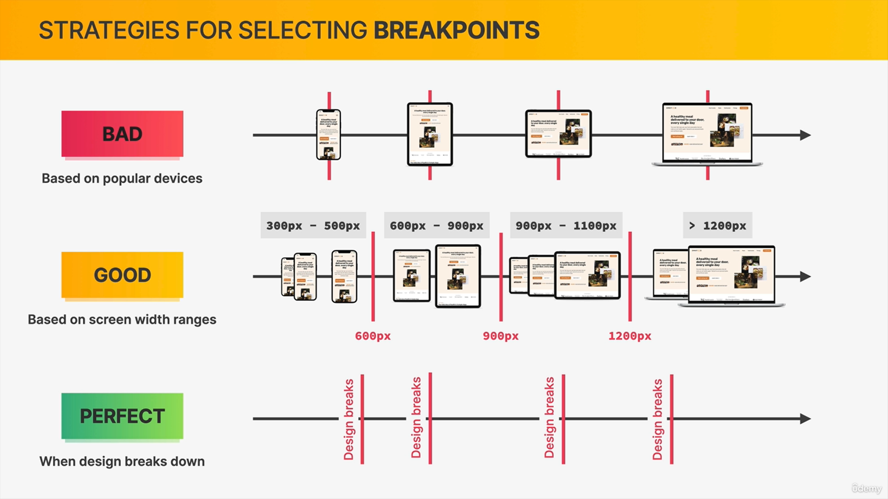

# Html

### forms in html
```html
 <form>
<label>first name</label>
<input type=”text” name=”first Name” placeholder=”enter your name”>
<label> gender</label>
<select  name=”gender”>
<option value=”male”>male</option>
<option value=”female”>female</option>
</select>

</form>
 ```
### image in html
```html
 
``` 
### link
```html
<a href=”address”> </a>
```

```html
<abbr title=”world wide web”> www</abbr>
```
**abbr will have curly line under it and if we hover it will show title.**
### Html5 tags
```html
<header></header>
<nav></nav>
<section></section>
<article></article>
<aside></aside>
<footer></footer>
```
# css
### link to css in html(in head)
```html
<link rel="stylesheet" type="text/css" href="css/style.css"/>
```
### boxModel in css

# responsive
### how media queries work (with max-width )
we want to apply a certain style for the range between **0 and 600 pixles**we would write a media queris like this 
```css
@media (max-width:600px)
```
this will check if the current viewport width a smaller or equal than 600 pixles then all the css code that is in this media query will apply.
**At 700px it will not work**
### selecting breakpoints.
### what are breakpoints?
breakpoints are the viewport with at which we want or designed to change, breakpoints are the pixel values,that we want to put in all media queries.



 


